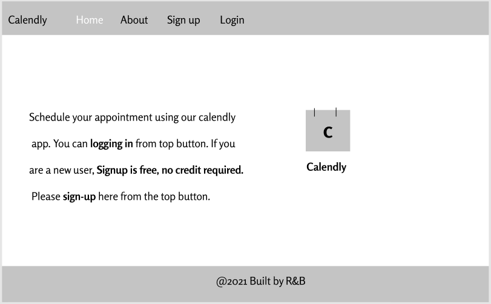
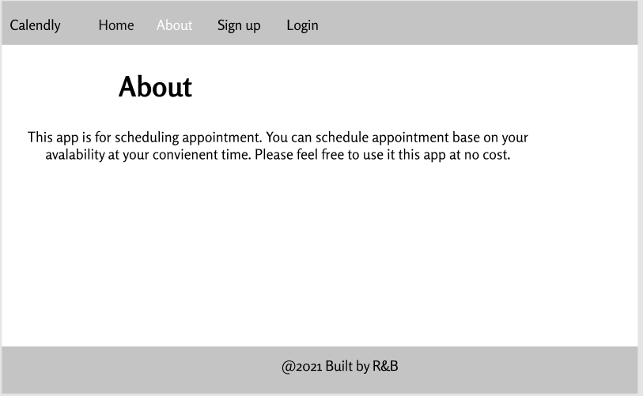
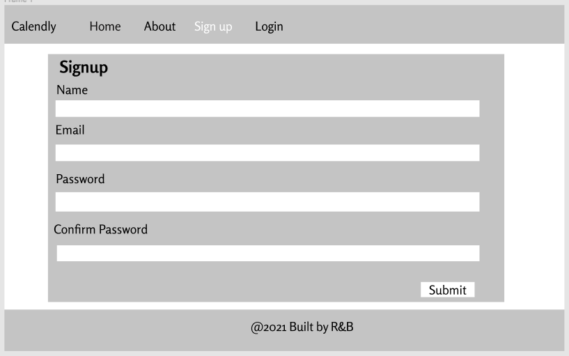
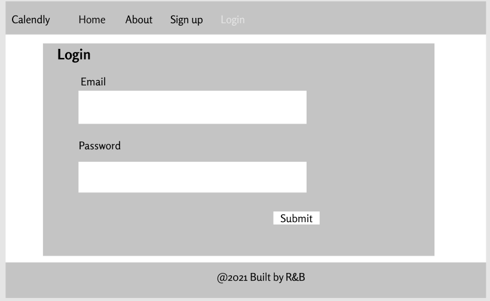
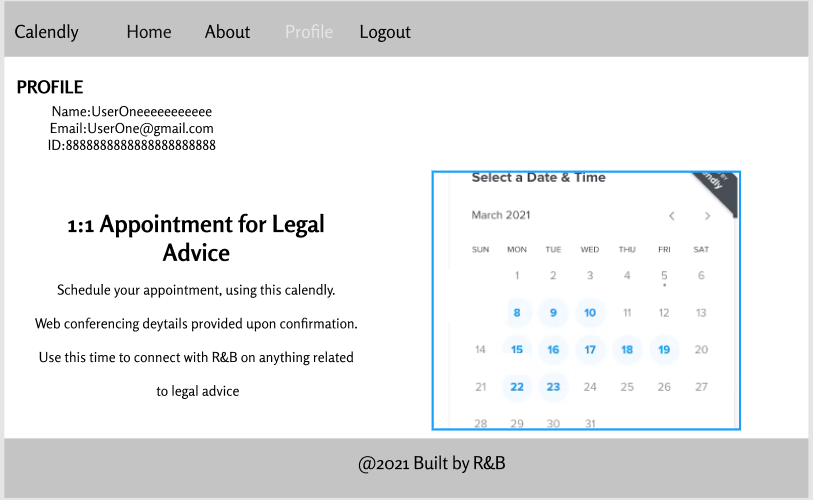
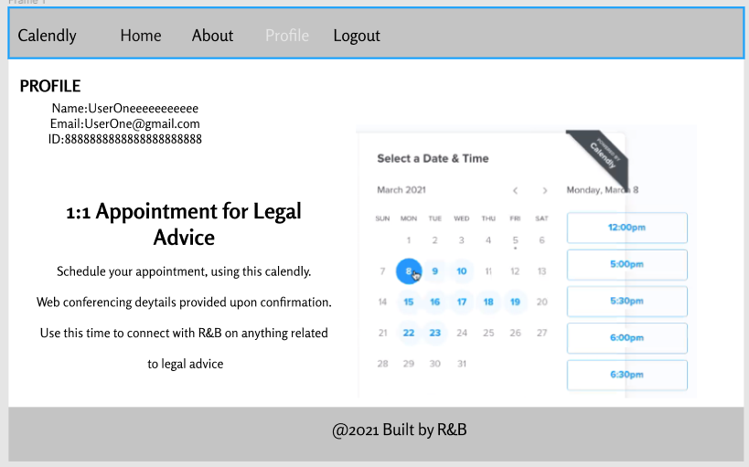
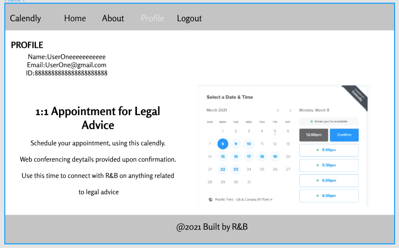
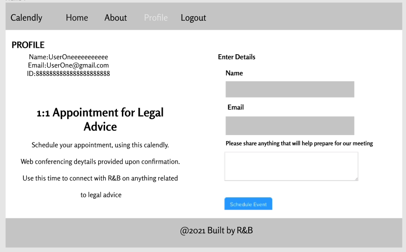
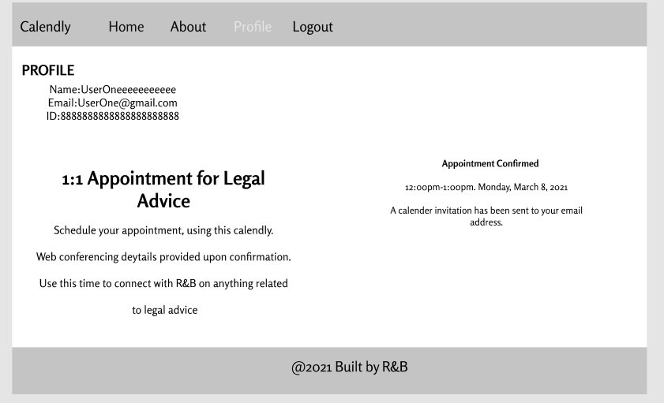

#  Application

## my calender app
* This application is for scheduling appointment, it can be used by alot of user's to schedule appointment, anyone can schdule apointment base on avalability with this app.

### Motivation

* I will like to put all what have learnt in to practice to build user's friendly app.

---

## Screenshots of the apartment 

---
### User Stories
An application designed and developed for scheduling appointment, by scheduling appointment and viewing avalability without putting a call through to schedule the appointment.

* new user can sign-up to schedule appointment
* previous user can login with their password and email to schedule appointment
* all user can schedule appointment base on avalabilty
* zoom link will be sent to them for their appointment.
---

### Wireframes

)

)

)

)

)

)

)

)

---
## Data Models 

#### TO CREATE MODEL:

* calender
* user

 * sequelize model:create --name apartment --attributes name:string,bedrooms:integer,bathrooms:integer,residentId:integer

 * sequelize model:create --name user --attributes name:string,license:string,email:string,password:string

 * sequelize model:create --name review --attributes name:string,email:string,content:text,apartmentId:integer

## ERD - entity relationship diagram
* one to many relationship

---

## Technologies 
### Languages
* Node.js
* Html
* CSS
* react
### Dependencies
* ejs
* express
* bcrypt
* connect-flash
* dotenv
* ejs
* express
* express-ejs-layouts
* express-session
* morgan
* passport
* passport-local
* pg
* sequelize
### Testing 
* chai
* mocha
### Version control
* git
* github
### Database
* mongoose